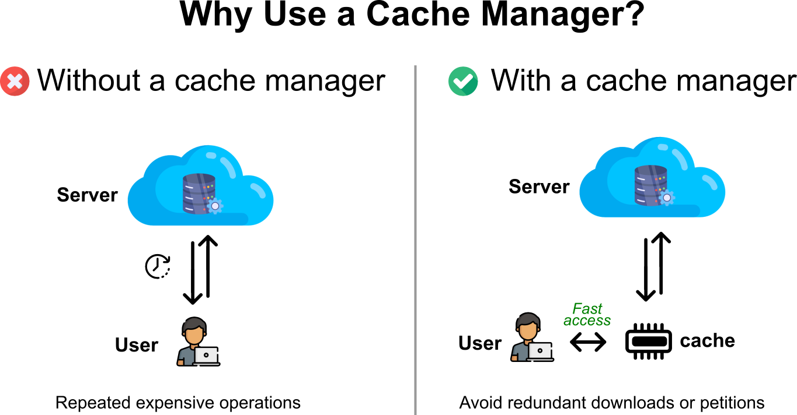

# Managing Cache without effort

Would you like to handle the cache of your application easily and without effort? This package is for you. **Omnicache** is flexible and transparent cache manager and it works based on the following principles:

1. Modularity - like Lego pieces, the code has been built based on well defined responsibilities and abstractions.
2. Integration - use this package as another module in your wonderfull application.
3. User centric - we aim to reduce any kind of complexities

TODO: Add a diagram that in someway the user can understand the idea behind the Cache manager.

